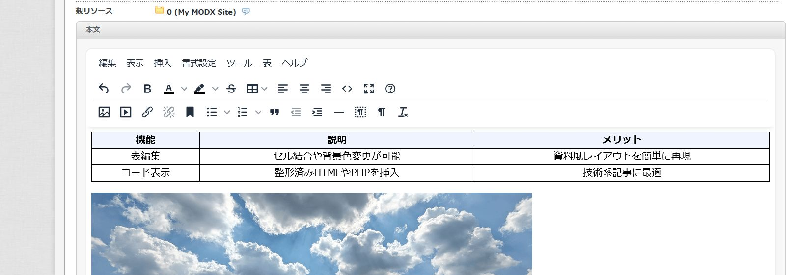

# TinyMCE 7 プラグイン

MODX Evolution で最新の TinyMCE エディターを利用できるようにするプラグインです。

> **安定版について**
>
> 現在の安定リリースは `v1.0.0` です。運用環境へ導入する前にテスト環境で動作を確認したうえでご利用ください。

## 特長

* 文字装飾や画像挿入など、管理画面でのリッチテキスト編集をより快適にします。
* 管理画面・フロントエンドの両方で同じエディター体験を実現します。
* MODX Evolution 標準の MCPuk ファイルブラウザーと連携し、画像やファイルを簡単に選択できます。
* 画像をクリック／ダブルクリックすると Cropper.js を使ったトリミング・回転・サイズ変更が行えます。

## スクリーンショット

## 導入手順

1. プラグイン一式をダウンロードします。
2. FTP で MODX Evolution の設置ディレクトリに接続し、`assets/plugins/tinymce7/` フォルダーを作成します。
3. ダウンロードしたファイルをすべて `assets/plugins/tinymce7/` にアップロードします。
4. 管理画面にログインし、**エレメント → プラグイン** を開きます。
5. 「新規プラグイン作成」をクリックし、ソースコード欄に `tinymce.install_base.tpl` の内容を貼り付けるか、該当ファイルを指定します。
6. プラグイン名を「TinyMCE7」など任意に設定し、以下のイベントを関連付けます。

   * `OnRichTextEditorRegister`
   * `OnRichTextEditorInit`
   * `OnInterfaceSettingsRender`
7. 保存後、リソース編集画面でエディターが有効になっていることを確認します。

## カスタマイズ

* **ツールバー設定**: グローバル設定またはユーザー設定の「TinyMCE7 ツールバー構成」から、シンプル／ベーシック／レガシー／フルの各構成を選択できます。
* **メニューバー表示**: 必要に応じてメニューバーを表示・非表示に切り替えられます。
* **TinyMCE 本体の読み込み元**: デフォルトは CDN (`https://cdn.jsdelivr.net/npm/tinymce@7/tinymce.min.js`) です。ローカルで使いたい場合は公式パッケージの `tinymce/` を `assets/plugins/tinymce7/tinymce/` に配置し、設定に `"tinymce_use_local": true` を追加してください。CDN・ローカル問わず別の URL を使う場合は `config/manager.json` や `config/frontend.json` に `"tinymce_script_url"` を指定します。
* **言語ファイル**: 日本語などの UI 言語はローカルの `assets/plugins/tinymce7/tinymce/js/tinymce/langs/`（または `assets/plugins/tinymce7/langs/`）に置いた公式 `langs/*.js` を読み込みます。TinyMCE 公式配布の言語パックをダウンロードして配置してください（CDN フォールバックはありません）。

詳細な設定や開発者向け情報は [TECHNICAL.md](docs/TECHNICAL.md) を参照してください。

## トラブルシューティング

* エラーが発生した場合は、ブラウザーの開発者ツールでコンソールを確認してください。問題の再現手順や取得したログを添えて、GitHub プロジェクトの Issue や Pull Request で報告いただけると助かります。

## ライセンス

本プロジェクトは [MIT License](LICENSE) のもとで公開されています。
